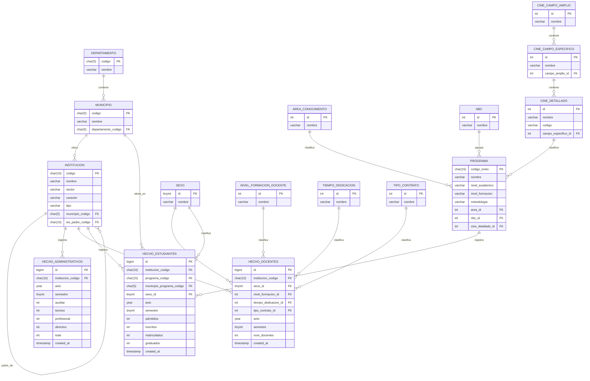

# EER SNIES (modelo relacional para generar código)

## Lectura rápida del modelo

- **departamento 1:N municipio**
- **municipio 1:N institucion**
- **institucion 1:N institucion** por la relación de sede padre
- **programa** depende de **area_conocimiento**, **nbc** y **cine_detallado**
- **cine** queda en jerarquía de 3 niveles: **campo_amplio → campo_especifico → detallado**
- Los hechos quedan separados por dominio: **administrativos**, **docentes** y **estudiantes**

## Recomendación para tu programa

Si vas a generar las tablas desde código, este EER es ideal para implementar:
1. primero las tablas catálogo,
2. luego las dimensiones fuertes,
3. y al final las tablas de hechos.

Así evitas errores de claves foráneas durante la migración.

